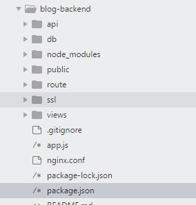

# 一、构建前后端分离的博客系统 #
## 后端blog设计 ##
### 项目前期准备 ###
后端使用的是 node.js + mongoose + koa。模板引擎是ejs。
###  ###
## 前端blog设计 ##
### 项目结构初始化 ###
    npm i koa ejs  mongoose jsonwebtoken --save
	npm i koa-bodyparser koa-convert --save
	npm i koa-cors koa-jwt koa-multer koa-onerror --save
	npm i koa-route koa-sslify koa-static koa-views opener --save
### 项目结构 ###

### 入口编码 ###

# 二、微信公众号的开发运营 #

# 三、 node全栈 #

# 四、 要读的书 #
